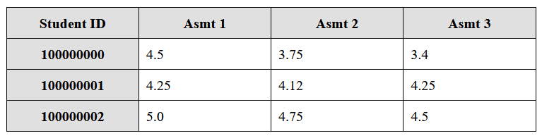
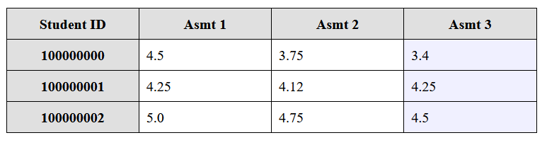
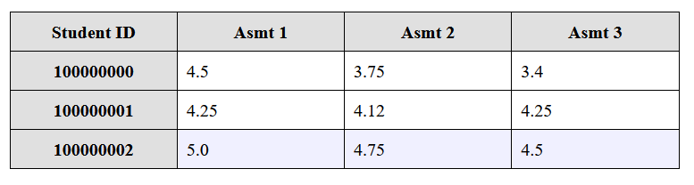
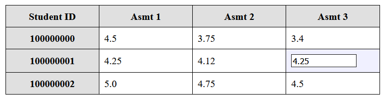
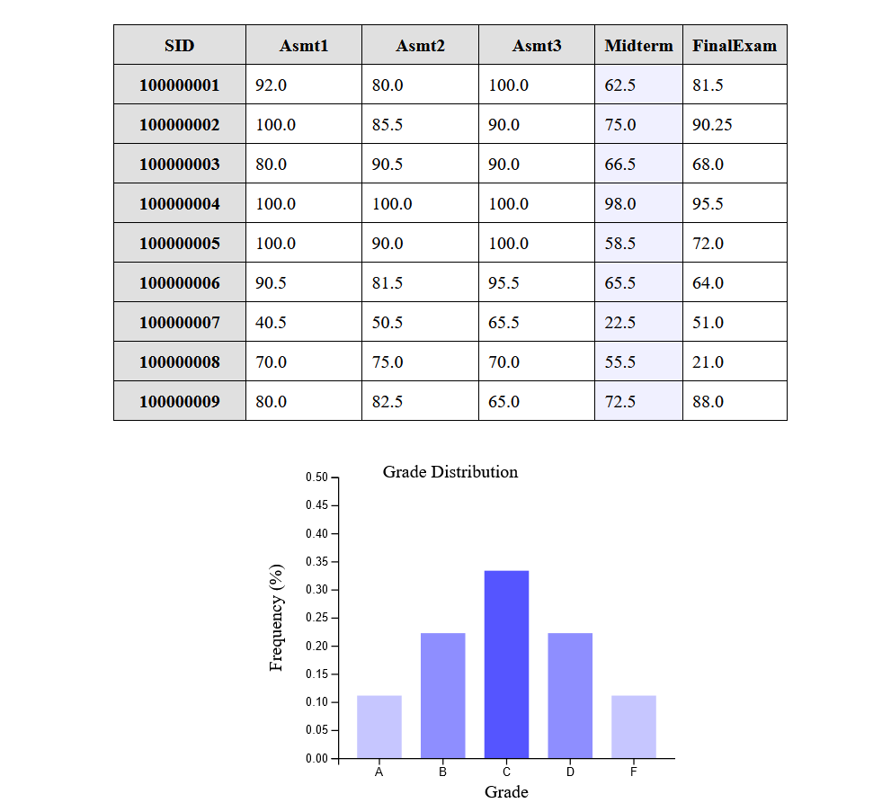

# Lab 04-06

The starter code for lab 04-06.

## Overview

Let's create the skeleton of a web-based spreadsheet program using HTML, CSS, jQuery, and D3.

_**Note:** This lab is designed to take 3 weeks, and is divided into three parts.  Each of the three parts is worth the weight of one lab assignment (3% each).  It is recommended that you do the content and layout in the first week, the design of the overall page and interaction system in the second week, and finally the data population in the third week._

## Part 1 - The Basic User Interface

### Spreadsheet Design

The spreadsheet table will be relatively simple in design.  The spreadsheet will be a simple HTML table, centred in the web page.  The table will have a set of column headers in the first row, and a set of row headers in the first column.  Each of these headers will be clickable, and will have jQuery event handlers.  If the column header is clicked, then the cell in that column in every row should be selected.  If the row header is clicked, then the cell in that row in every column should be selected.

Implement the following functions (you can add more if you wish) using jQuery:

- `deselectAll()` - de-selects every cell in the spreadsheet
- `selectRow(rowIndex)` - selects every non-header cell in the specified row (indexed, starting with zero)
- `selectColumn(colIndex)` - selects every non-header cell in the specified column (indexed, starting with zero)

Column headers will have `#e0e0e0` for their background colour, and selected cells will have `#f0f0ff` for their background colour.

_**Note**:  When any header is selected, first de-select anything that was previously selected._

_**Note**:  All styling information should be included in the provided CSS file (`spreadsheet.css`)._

_Figure 1 - The spreadsheet with nothing selected_

_Figure 2 - The spreadsheet with a column selected_

_Figure 3 - The spreadsheet with a row selected_

## Part 2 - Interactivity

### Editable Cells

Each of the `td` elements in the spreadsheet needs to be editable.  This will be implemented by adding a click handler for those elements, which will replace the simple text content with a text field (with the value set appropriately, so that it contains the previous value).  When the `ENTER` key is pressed, the text field will be replaced by simple text again, but this time with the new value that the user has entered.

_Figure 4 - The spreadsheet with a cell being edited_

### Chart

When a column or row has been selected, you will extract the data into an array of values, will calculate the frequencies of each letter grade equivalent, and finally will use D3.js to create a simple bar chart of those values.  Each time a new row or column is selected, this chart will replace any previous charts.  

The frequencies will be a dictionary with 5 keys: `A`, `B`, `C`, `D`, and `F`.  The value for each will be a number between `0` and `1`.  You can calculate this by dividing the number of occurrences of each letter grade with the total number of marks/grades.

_**Note**:  You can assume that the user has only entered floating point values._

_**Note**:  There has been a function provided which converts a mark (out of 100) to a letter grade (`A` - `F`).  You should use this function._

_Figure 5 - The spreadsheet showing a bar chart for the selected data (by column)_

## Part 3 - Dynamic Content

### Loading Data

Using AJAX (either using jQuery or using `fetch()`, your choice) download the file `grades.csv` from a basic Python web server, and dynamically generate a table based on this data.  This table will use all of the functionality described in parts 1 and 2, and will take the place of the hard-coded table used in the previous two parts.  Building the table can be done using plain JavaScript, jQuery, or D3 (your choice).

To start a basic server, use the following command:

`python -m http.server 8000`

You will need to move the code to add the event handlers to the `td` and `th` tags to just after the table has been generated.

## Need Extra Challenge?

If this was too easy, and you want some additional practice, try out one or more of the following extra features for increased learning:

1. Implement a sort by column when a column header is selected.
2. Implement keyboard navigation to allow the cursor keys to move up/down between rows, or left/right between cells within a row, while editing cells.  Moving to another cell will save the data into the `td` contents.

## Getting Help

If you run into difficulty, you may wish to check out some of the following resources:

- https://developer.mozilla.org/en-US/docs/Learn/HTML - Tutorials and reference documentation for HTML by the Mozilla Developer Network (MDN)
- https://developer.mozilla.org/en-US/docs/Learn/CSS - Tutorials and reference documentation for CSS by the Mozilla Developer Network (MDN)
- https://developer.mozilla.org/en-US/docs/Web/JavaScript - Tutorials and reference documentation for JavaScript by the Mozilla Developer Network (MDN)
- https://www.w3schools.com/ - Tutorials for HTML, CSS, JavaScript, and jQuery by the W3Schools group
- https://github.com/d3/d3/wiki - A guide for D3.js, by the D3 team
- https://learn.jquery.com/ - Tutorial for jQuery, by the jQuery team
- http://stackoverflow.com/ - A forum for asking questions about programming.  I bet you know this one already!

Of course, you can always ask the TA for help!  However, learning how to find the answers out for yourself is not only more satisfying, but results in greater learning as well.

## How to Submit

Create your code inside this folder, commit, and then push your code to this repository to submit your lab assignment.